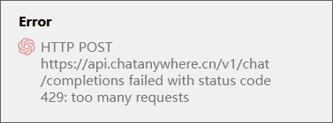
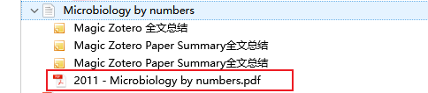
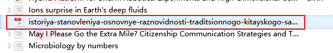

# 文献总结常见问题

::: tip
如果遇到问题，可以尝试关闭或重启 Zotero，也可以试试更新插件到最新版本[准备事项](../quickStart/preparations.md)
:::

**Q3-1** 常见 GPT 接口返回错误信息
    
- too many requests ，接口请求次数过多

一般是 GPT 接口使用频率高，导致接口平台处理不及时，可重启 Zotero，或咨询出售接口客服

**Q3-2** 为什么我打开了PDF，可是不能进行全文总结

  - 请确保该 PDF 文件有相应的父级条目，如下图是一个拥有父条目的 PDF 和一个无父级条目的 PDF

