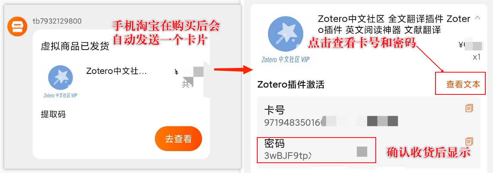

# 插件购买与激活

## 购买

我们插件目前是在淘宝上出售卡码，购买链接 👉 [淘宝链接](https://item.taobao.com/item.htm?spm=a21n57.1.0.0.24fe523cKyLqRm&id=735669457105&ns=1&abbucket=11#detail)。

下单，付款**并确认收货后**，系统会自动在**最新版手机淘宝**上发送一个带有卡号和密码的卡号。

请大家妥善保管好自己的卡号与密码，并尽快使用。一般该自动发送的卡号会在**3个月**左右消失，如果你后面忘了自己购买的卡号与密码，请凭订单号与我们联系，我们会帮你找到相关的信息。

::: tip
一定需要确认收货后，才会发送卡号以及密码。同时需要在最新版的手机淘宝上才会接收到机器人发送的卡码信息
:::

如果你想联合其他同学一起团购，可直接旺旺联系，会有相应的团购价格。我们也有邀请注册并返现的机制，直接按购买价格的10%，返现给邀请用户。后面我们会统计并将现金直接返现到个人支付宝上。

## 插件激活

获取了卡号与密码后，请[点击链接，如显示乱码，请右键另存为](https://gitee.com/zotero-chinese/zotero-magic-for-user/raw/master/zotero-magic-for-user.xpi)下载最新的 Magic for Zotero 插件，并安装。

::: info
请确认安装了所依赖的其他插件，详细情况可参考[准备事项-依赖插件安装及更新](./preparations.html#依赖插件安装及更新)
:::

首先需要登录 Zotero 账号，插件激活需要绑定一个 Zotero 账号

登录成功后，切换到 Magic 设置窗口，在激活表单输入对应的**卡号**与**密码**。邀请码不是必填项，如果别人邀请你购买，你也可以输入对方的激活码，后期我们会统一对邀请用户返现。

激活成功后会有相应的提示

::: info
本插件与 Zotero 账号绑定，不与设备绑定。不同设备不需要再次激活，只需要登录同一账号即可！
:::

如果在激活过程中遇到问题，可到[常见问题-激活](../faq/activate.md)查看相关解决办法

