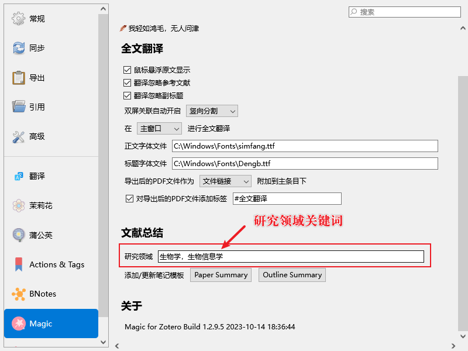

# 文献总结 

::: tip
如果遇到问题，可以尝试关闭或重启 Zotero，也可以试试更新插件到最新版本[准备事项](../quickStart/preparations.md)
:::

## GPT 接口参数设置

::: tip
GPT 参数需要在 Zotero GPT 插件中进行设置，设置办法也是依照该插件的设置方法
:::

在 Zotero 中，按`Ctrl + /`，唤起 Zotero GPT 对话窗口


这里只关注三个参数：**model**，**secretkey**，**api**，在弹出窗口输入下方的命令（可使用命令`/help`查看帮助信息）：

- `/model`：使用`/model gpt-3.5-turbo-16k`可使用16k模型。使用其它模型会导致 GPT 输入字符数限制，GPT 总结报错
- `/secretkey` ： 无论是官方key还是第三方均需设置
- `/api` ： 
	- 如使用 OpenAI 官方接口，可不必设置
	- 第三方key需在三方网站查看填写`/api 这里换成第三方接口地址`
	- `/api default`  回到默认api（即官方）
- `/clear` 对某论文进行解析后，可clear命令清除上下文，避免影响下一篇论文。如果是同论文可不clear

## 获取文献总结模板

目前文献总结有两套模板

1. **Paper Summary**， 文章全文总结，适合从整体了解文献内容，快速获取文章主要内容
2. **Outline Summary**，按照章节，对各章节进行总结。适合各章节内容的快速消化，深入了解各章节内容

打开 Magic for Zotero 插件的设置界面


点击**Paper Summary**和**Outline Summary**，会有添加/更新成功的提示(💣如果你已自定义模板，点击之后会将原有模板覆盖掉)。

为了让 GPT 了解你目前研究的专业领域，需要手动编辑**Paper Summary**研究领域关键词。

打开 Zotero 编辑  -> 模板编辑器  


## 文献总结模板个性化修改

### 研究领域关键词设置
根据自己研究领域，在文献总结模板中更新关键词列表，可以提升 GPT 总结质量



可以设置多个研究领域关键词，中英文均可。

### 论文大纲识别单词设置

文献大纲的识别和拆分需要依赖关键单词，用于区分文献的前言，背景，方法，数据，总结，结论，讨论，结果等内容区域。这部分是可选内容，如果 GPT 总结失败，可查看论文标题大纲标题是否与模板中设定一致。


```javascript
// 按照已有的格式，手动添加，注意引号与方括号
// 前言部分
const sectionInfo = await sharedObj.getSectionInfo(["intro","background"])
// 研究方法部分
const sectionInfo = await sharedObj.getSectionInfo(["method","Data","Measurement"])
// 文献总结部分
const sectionInfo = await sharedObj.getSectionInfo(["conclu", "conclusions","result", "disscuss"])
```

模板中其他关于 GPT 各部分的提示词，可以自定义设置，也可以提升 GPT 文献总结质量。

::: warning
如果你已经编辑好了适合自己的文献总结模板，建议先备份到本地。如果你重新点击上面的**Paper Summary**和**Outline Summary**，会覆盖原有的模板内容。
:::

