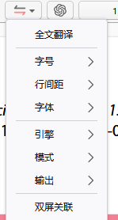

# 全文翻译

::: info
全文翻译依赖于插件 Zotero PDF Translate，请确保使用的插件是最新版本。请参考[准备事项](./preparations.md)
:::

打开一个英文 PDF，在阅读器上方菜单会看到**全文翻译功能按钮**

## 全文翻译功能菜单说明

- **全文翻译（翻译后该列表项变为显示原文）**
	- 对英文论文进行全文翻译
		- 部分图表显示正在优化
	- 显示原文
		- 翻译后的论文通过**显示原文**按钮变为翻译前的原文
- **字号&行间距&字体**
	- 对翻译后的展示进行格式调整。
	- 注意：字号或行间距会影响翻译后的界面排版，可能会导致翻译内容覆盖等
- **引擎**
	- 选择**翻译引擎**（与translate插件独立设置）
	- 注意
		- 部分引擎需要**密钥**，可自行百度如何获取，有免费申请也有付费的
		- 部分引擎有翻译字数限制，如知网等，不建议使用
		- 全文翻译token，不是过于富裕不太建议deepl和gpt
		- 负载均衡：自动选择翻译引擎进行翻译，网络状况不佳考虑
- **模式**
	- 逐句/逐段翻译
	- 影响将论文内容呈送给引擎的是按一句还是一段
	- 注意
		- 部分引擎限制输入文本数时可将逐段改为逐句
		- 翻译质量和阅读流畅度相差不大
		- 逐段翻译速度较快
		- 会影响输出设置中的引用情况（引用一段还是一句）
		- 会影响跳转原文后，显示的原文是一句还是一段
- **输出**
	- 更改输出为PDF还是md
	- PDF（默认）
		- 在zotero阅读界面覆盖原文
		- **crtl+鼠标点击翻译内容**  ：跳转回原文
	- md格式（可通过bn插件中介实现pdf文件导出）
		- 在笔记区生成全文翻译md文件
		- 每个翻译单元存在引用的citations，点击可跳转
			- 可在笔记界面 **右上角三点-隐藏注释引注处关闭**
	- 如显示XML解析失败
		- 更换翻译引擎
		- 如果谷歌翻译，确定网络环境
- **双屏关联**
	- 建立**左右双屏（一面翻译，一面原文**），单屏划动时，另一屏伴随划动
	- 注意
		- 在论文表格过多，格式奇葩时可方便同时阅读**原文译文**
		- 如何取消：**鼠标右键 取消页面分割**

## 全文翻译功能视频演示(等补充)

## 全文翻译其他功能说明

- **crtl+鼠标点击**  ：可将该翻译单元跳回原文
- 鼠标悬浮（可**悬浮窗显示原文**，暂时无法修改字体，可在插件设置处取消）
- **副标题默认不翻译**（可在插件设置处选择）
- **参考文献默认不翻译**（可在插件设置处选择）
- **translate实时查看及复制**
	- 安装最新版translate插件
	- 打开侧边栏
	- 鼠标放置在翻译后文本处，会自动调取翻译结果和原文，显示在tranlate插件侧脸框内，不用点击
	- 可在translate插件侧栏框内进行复制粘贴操作