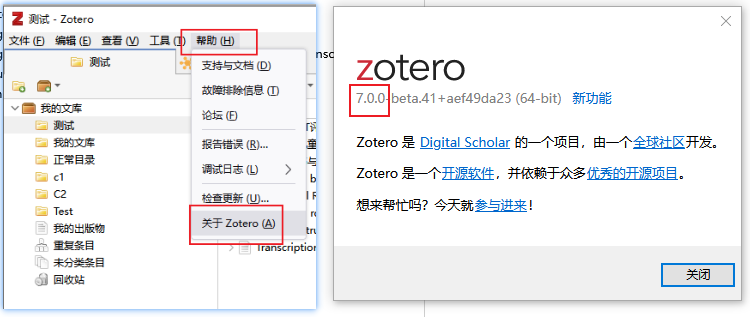

# 准备事项

::: info
Magic for Zotero 插件在使用中会收到许多用户的反馈，插件也会频率的进行更新，所以为了获得更好地使用体验，请确保你安装的 Zotero 7 和各插件版本都是最新的
:::

## Zotero 7

目前插件只适配 **Zotero 7 beta** 版，请确保你电脑上的 Zotero 已经从版本 6 升级到版本 7。最新版的 Zotero 7 beta 版可从[Zotero 7 beta 下载链接](https://www.zotero.org/support/beta_builds)下载，注意下载对应的操作系统版本。

从 Zotero 6 升级到 Zotero 7 最简单的办法就是覆盖安装，安装完成之后再启动，就是 Zotero 7 版本。如果你之前没有安装使用过 Zotero 6，直接安装 Zotero 7 即可。

在 Zotero 上方**帮助** -> **关于Zotero**，就可查看目前安装的 Zotero 版本，版本最前显示**7.0.0**，说明升级成功。

## 依赖插件安装及更新

Magic for Zotero 插件强大的功能需要依赖现在的插件：[Zotero GPT](https://github.com/MuiseDestiny/zotero-gpt)，[Zotero Better Note](https://github.com/windingwind/zotero-better-notes)，[Zotero PDF Translate](https://github.com/windingwind/zotero-pdf-translate)。

在安装本插件前，请一定要确保依赖插件时刻保持最新版本。建议直接到中文小组[Zotero 插件商店](https://plugins.zotero-chinese.com/#/)下载最新的插件。

::: tip
如果你在使用中遇到各种奇怪的问题，可以先检查一下，目前使用的插件是否是最新版本。可到 **工具** -> **附加组件**，在插件列表，点击插件名称，就可以看到插件的版本号
:::