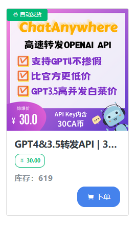

# 付费 GPT API 接口

::: warning
本文档中所罗列的各类 GPT 代理服务，来源于网络或群分享。我们与这类代理服务商无任务关联，仅仅介绍其使用方法。如果遇到接口使用问题，请与相应的代理商联系。
:::

## 佩奇 GPT 商店

店铺地址：[https://peiqishop.me/](https://peiqishop.me/)

根据群里同学交流反馈
  - 一般30元套餐即可,大概可以使用几个月
  - 包括各类模型（文献总结使用的gpt-3.5-turbo-16k模型）
  - 具体的使用额度可以直接到商店网站上查询
  - 记住下单时**请填写正确的邮件地址**，后面的 API 接口地址和密钥都会发送到填写的邮箱中
